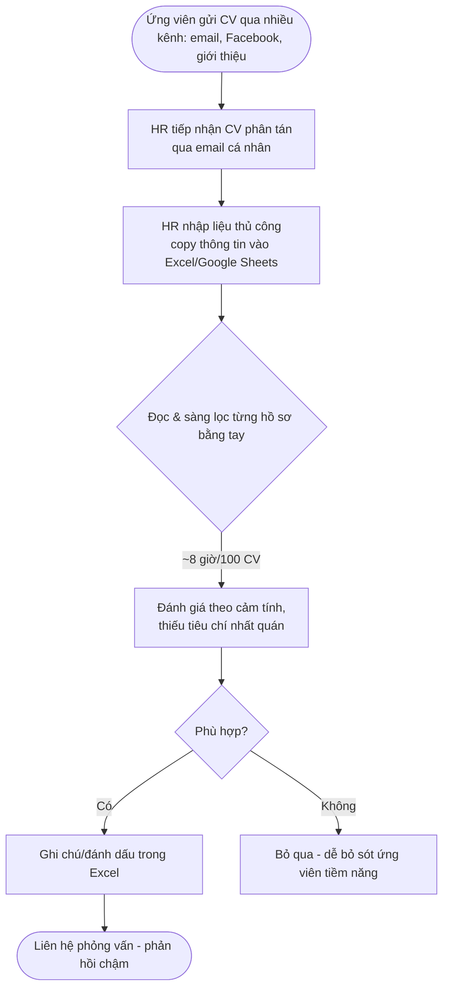
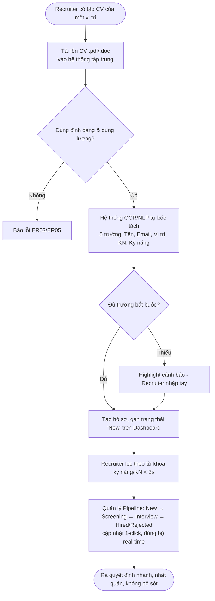

# BPMN As-is / To-be — GenG ATS (Project C)

> Khắc phục feedback: *"BPMN cần chuẩn xác đủ cả As-is và To-be và diễn giải rõ sự cải tiến, tối ưu hóa."*
> Nguồn: BRD §5 Present Process & §6 Proposed Process, FRS. Sơ đồ vẽ bằng Mermaid (render trực tiếp trên GitHub/VS Code).
> Khuyến nghị: dựng lại bản chính thức trên draw.io với chuẩn ký hiệu BPMN 2.0 (Pool/Lane, Gateway, Event).

## 1. AS-IS — Quy trình tuyển dụng thủ công (hiện tại)

**Điểm đau (Pain points):** dữ liệu phân tán; nhập liệu tay tốn thời gian; sàng lọc ~8 giờ/100 CV; đánh giá chủ quan, thiếu nhất quán; dễ bỏ sót ứng viên; phản hồi chậm → trải nghiệm ứng viên kém, chi phí tuyển dụng cao.

## 2. TO-BE — Quy trình với hệ thống GenG ATS (đề xuất)

**Cải tiến cốt lõi:** tập trung hoá dữ liệu; tự động hoá trích xuất (OCR) → giảm 30% nhập liệu tay; lọc từ khoá <3s thay cho đọc tay; pipeline trực quan 1-click; phân quyền RBAC + bảo mật AES-256.

## 3. Bảng diễn giải cải tiến (As-is → To-be)

| # | Bước As-is | Pain | Bước To-be | Cải tiến | Lợi ích định lượng |
|---|---|---|---|---|---|
| 1 | Nhận CV qua email/nhiều kênh | Phân tán, dễ thất lạc | Upload tập trung 1 nơi | Centralization | 1 nguồn dữ liệu duy nhất |
| 2 | Nhập liệu tay vào Excel | Tốn thời gian, sai sót | OCR/NLP parse 5 trường | Tự động hoá | **-30%** thời gian nhập liệu (mục tiêu) |
| 3 | Đọc & sàng lọc từng CV (~8h/100) | Chậm, mệt | Lọc từ khoá tức thì | Tìm kiếm | Kết quả **<3s** |
| 4 | Đánh giá cảm tính | Thiếu nhất quán | (Đề xuất) chấm điểm có trọng số | Khách quan hoá | Xếp hạng nhất quán |
| 5 | Theo dõi trạng thái rời rạc | Khó nắm pipeline | Kanban 1-click, real-time | Trực quan hoá | Cập nhật tức thì, không reload |
| 6 | Không kiểm soát truy cập | Rủi ro lộ dữ liệu | RBAC + AES-256 + Audit Log | Bảo mật | Tuân thủ luật BVDLCN |

> Lưu ý phạm vi (theo đề bài GAP): **Out-of-scope** = Job Posting API, Email Automation, Talent Pool, Analytics Dashboard → To-be dừng ở "ra quyết định", không vẽ nhánh gửi email tự động.
