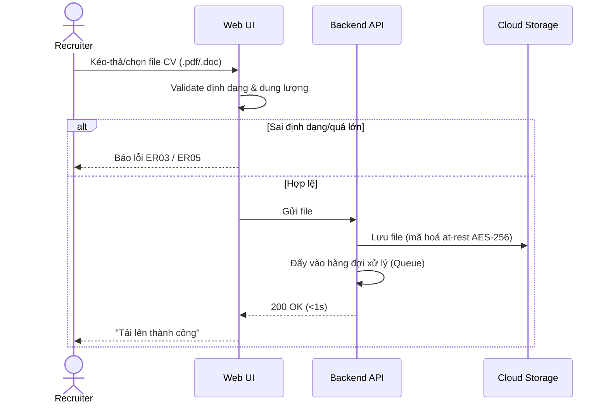
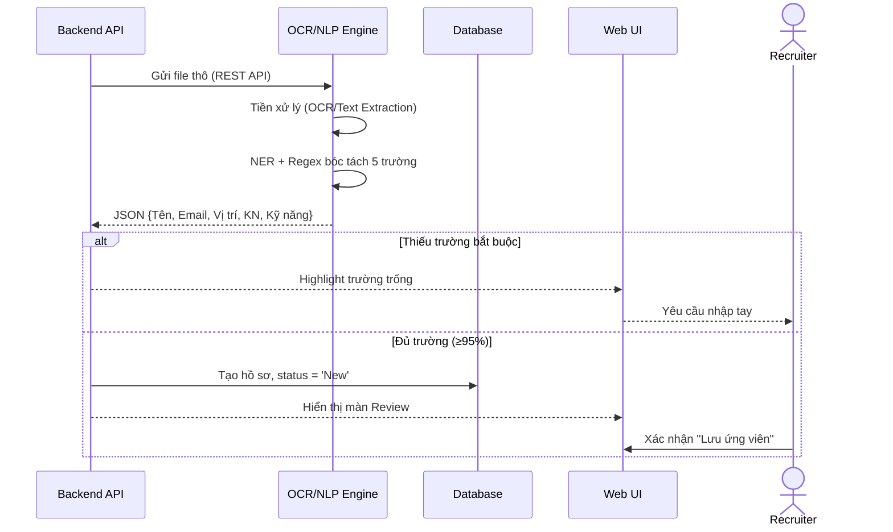
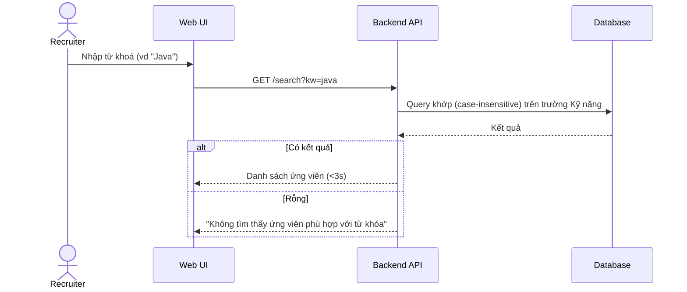
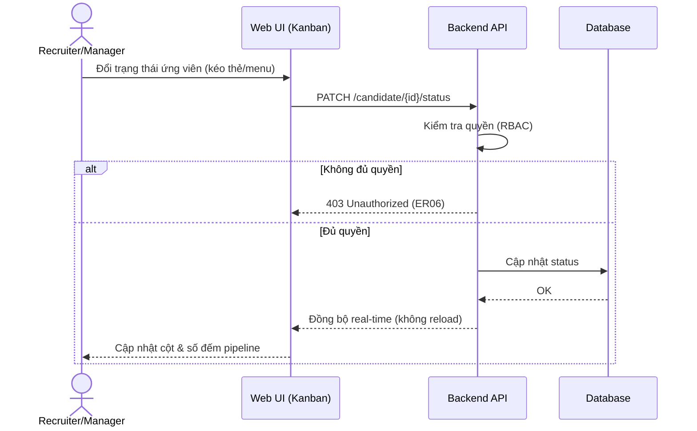
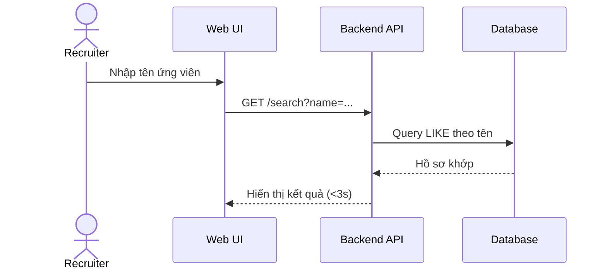
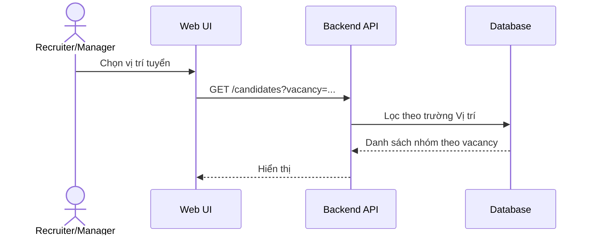
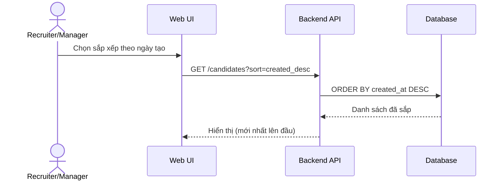

# Sequence Diagrams theo từng Use Case — GenG ATS (Project C)

> Khắc phục feedback: *"Chưa phân tách tốt Use case và vẽ được Sequence Diagram cho mỗi Use case."*
> Mỗi Use Case (UC-01..UC-08) có một Sequence Diagram riêng (SEQ-01..SEQ-08), khớp bảng Traceability.
> Participants bám kiến trúc trong FRS: Recruiter, Web UI, Backend API, OCR/NLP Engine, Cloud Storage, Database.

## SEQ-01 · UC-01 Tải lên CV (FR-001)


## SEQ-02 · UC-01 Trích xuất CV / Parsing (FR-002)


## SEQ-03 · UC-02 Sàng lọc theo Từ khoá (FR-003)


## SEQ-04 · UC-03 Quản lý trạng thái Pipeline (FR-004, FR-009)


## SEQ-05 · UC-04 Tìm theo tên (FR-005)


## SEQ-06 · UC-05 Lọc theo vị trí / Vacancy (FR-006)


## SEQ-07 · UC-06 Lọc/Sắp xếp theo ngày (FR-007)


## SEQ-08 · UC-07 Tạo từ khoá vị trí (FR-008)
```mermaid
sequenceDiagram
    actor M as Manager
    participant UI as Web UI
    participant API as Backend API
    participant DB as Database
    M->>UI: Mở "Tạo từ khoá vị trí", nhập keyword set
    UI->>API: POST /job-keywords
    API->>API: Kiểm tra quyền (Manager)
    API->>DB: Lưu bộ từ khoá
    DB-->>API: OK
    API-->>UI: Xác nhận; dùng cho lọc/tìm
```

> UC-08 (Quản trị/RBAC/Audit) chủ yếu là luồng cấu hình + auth, đã thể hiện ở nhánh kiểm tra quyền của SEQ-04;
> nếu cần, bổ sung SEQ riêng cho "Đăng nhập + phân quyền" và "Ghi/đọc Audit Log".
